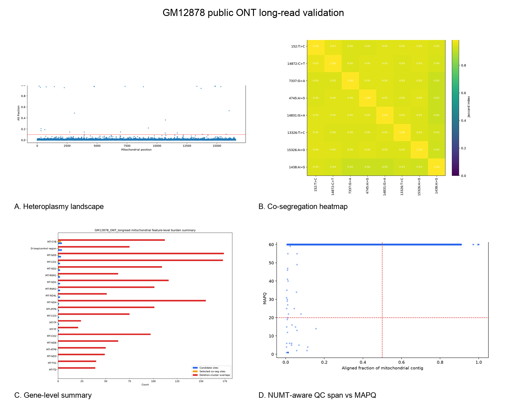

# mito-overview

`mito-overview` is a Python-based workflow for mode-gated mitochondrial DNA (mtDNA) evidence reporting from aligned BAM or CRAM inputs. The current public implementation is centered on a long-read-oriented profile derived from an internally exercised ONT mtDNA reporting workflow, with an auxiliary reduced short-read compatibility profile that preserves only the analytical layers that remain interpretable without long molecules or ONT methylation tracks. The repository emphasizes synchronized HTML, TSV, and figure report generation for mitochondrial QC, heteroplasmy screening, deletion-like structural screening, copy-number proxy estimation when nuclear context is available, feature annotation, same-read co-occurrence, and warning-oriented QC.

`mito-overview` is research software for report generation and reproducibility-oriented review. It is not a clinical reporting engine, primary mtDNA caller, formal NUMT classifier, absolute mtDNA copy-number estimator, or diagnostic interpretation tool.

## Scope
- aligned BAM or CRAM input
- mitochondrial subset extraction
- heteroplasmy screening
- deletion-like structural screening
- mtDNA depth and copy-number proxy estimation
- mitochondrial feature and gene-level summarization
- NUMT-aware and circularity-aware QC
- optional exploratory methylation summaries
- HTML, TSV, and figure outputs per analytical section

## Implemented read profiles
- `long`
  - intended for ONT-style mtDNA workflows
  - supports the full current report structure, including long-read-only layers such as deletion screening, same-read co-occurrence, NUMT/circularity warning pages, and exploratory methylation
  - when ONT bedmethyl sidecars are absent, the core long-read layers still run and the exploratory methylation page degrades to an explicit status-only report
- `short`
  - intended for short-read mtDNA-aligned inputs
  - retains the applicable core pages and writes explicit `not_applicable` pages for long-read-only layers
  - currently exercised in the public repository as an auxiliary compatibility path with a synthetic toy sample and one public proof-of-principle example

## Current implemented scope
The public mirror currently covers the working core already ported from the internal pipeline. The modules below are implemented in the public mirror and exercised by the current synthetic smoke-test and example-bundle workflow:
- portable config loading
- run layout and provenance writing
- mitochondrial asset extraction
- shared HTML report rendering
- `mito_qc`
- `mito_heteroplasmy`
- `mito_deletions`
- `mito_copy_number`
- `mito_feature_annotation` with configurable human mtDNA GTF input
- `mito_cosegregation`
- `mito_gene_summary`
- `mito_numt_qc`
- `mito_identity_qc`
- `mito_variant_consequence`
- `mito_phymer_haplogroup` (optional human haplogroup enrichment)
- `mito_mvtool_annotation` (optional human external annotation enrichment)
- `mito_circularity_qc`
- `mito_methylation_exploratory`
- final sync into a persistent report directory

Human mtDNA currently has the clearest public configuration path. Human-specific external annotation and haplogroup layers remain optional, and non-human use should be limited to the reference-driven core modules unless separately validated.

## Relationship to other mtDNA software
`mito-overview` is designed to complement, not replace, established mtDNA tools. Variant callers, haplogroup classifiers, annotation services, contamination/NUMT tools, and visualization resources remain the right primary tools for their respective tasks. The narrower contribution here is a local, per-sample, mode-gated report bundle that keeps active analyses, optional enrichments, and unsupported assay layers synchronized.

For a reviewer-facing comparison with MToolBox, mtDNA-Server, HaploGrep, Phy-Mer, mvTool/MSeqDR, MitoVisualize, Haplocheck, MitSorter, and related mtDNA caller workflows, see [`docs/related_software_landscape.md`](docs/related_software_landscape.md).

## Synthetic smoke-test dataset
The repository contains a small synthetic dataset for installation checks and public example generation:
- [`examples/synthetic_data/TOY-001`](examples/synthetic_data/TOY-001)

This dataset is intentionally small and deterministic. It is meant for:
- environment checks
- smoke testing
- generation of the public example output bundle

The repository also includes a short-read synthetic example bundle generated from the same tracked toy inputs:
- [`examples/expected_reports/TOY-SR-001_output`](examples/expected_reports/TOY-SR-001_output)

Optional human-only enrichment pages are exercised locally in this repository with bundled fixture resources:
- a tiny deterministic Phy-Mer vendor stand-in under [`tests/fixtures/mock_phymer_vendor`](tests/fixtures/mock_phymer_vendor)
- a local mvTool-style annotation fixture under [`tests/fixtures/mock_mvtool_annotations.json`](tests/fixtures/mock_mvtool_annotations.json)

The corresponding expected public example output bundle is:
- [`examples/expected_reports/TOY-001_output`](examples/expected_reports/TOY-001_output)
- [`examples/expected_reports/TOY-SR-001_output`](examples/expected_reports/TOY-SR-001_output)

## Representative report views
The main figure below is the tracked public ONT long-read proof-of-principle montage from the GM12878 public asset pack. It is included to show the kinds of real report-native views the workflow generates in practice while keeping the underlying claims bounded to workflow execution, mode-gated status handling, and report production.



The repository also includes a complementary real public short-read proof-of-principle montage from GM11906:


## Installation
Create the public environment:

```bash
conda env create -f environment.yml
conda activate mito-overview
```

List the canonical workflow steps:

```bash
python -m mito_overview.cli --list-steps
```

Run a dry plan using the included example config:

```bash
python -m mito_overview.cli \
  --config examples/configs/human_example.env \
  --dry-run
```

Run through the public shell wrapper:

```bash
./scripts/run_mito_pipeline.sh \
  --config examples/configs/human_example.env \
  --steps validate,stage
```

Run the local synthetic smoke test:

```bash
./tests/smoke_public_pipeline.sh
```

Run the short-read synthetic smoke test:

```bash
./tests/smoke_public_pipeline_shortread.sh
```

Run the long-read smoke test without methylation sidecars:

```bash
./tests/smoke_public_pipeline_longread_nomethyl.sh
```

Generate the synthetic public example bundle from the tracked toy inputs:

```bash
./scripts/build_public_example_bundle.sh \
  examples/expected_reports/TOY-001_output
```

Generate the synthetic short-read example bundle:

```bash
./scripts/build_public_shortread_example_bundle.sh \
  examples/expected_reports/TOY-SR-001_output
```

Run the public reduced short-read proof-of-principle example:

```bash
./scripts/run_public_shortread_validation_gm11906.sh \
  /tmp/GM11906_reduced_shortread_output
```

Run the public long-read proof-of-principle example:

```bash
./scripts/run_public_longread_validation_gm12878.sh \
  /tmp/GM12878_ONT_longread_output
```

## Output contract
Each finished sample bundle is expected to contain:
- a mitochondrial BAM for inspection
- per-step TSV summaries
- per-step figures
- per-step HTML report pages
- a final sample bundle for archival or downstream review

A synthetic public-core example bundle is staged at:
- [`examples/expected_reports/TOY-001_output`](examples/expected_reports/TOY-001_output)
- [`examples/expected_reports/TOY-SR-001_output`](examples/expected_reports/TOY-SR-001_output)

Pages `01` through `14` in the example bundle correspond to the currently ported public report pages. In the bundled toy smoke-test path, pages `13` and `14` are exercised through local fixture resources so that a fresh clone can exercise the optional human enrichment interfaces without a private Phy-Mer checkout or live network dependency.

In the short-read targeted-mt profile, pages `03`, `04`, `06`, `08`, `09`, `11`, `12`, and `13` are expected to be explicit status pages rather than active long-read analyses. In a short-read WGS profile, page `04` can remain active as a depth-proxy layer, but the long-read structural and molecule-level pages remain status-only.

In long-read mode without ONT bedmethyl sidecars, page `12` is expected to be a stable status-only methylation report while the core long-read analytical pages remain active.

## Optional integrations
- Phy-Mer: optional human mtDNA haplogroup enrichment
- mvTool: optional human mtDNA external annotation enrichment
- these integrations are intentionally non-mandatory and should be treated as secondary annotation layers rather than the core analysis
- the repository's synthetic smoke-test path uses local fixtures to exercise these layers; real biological use should point to a true Phy-Mer vendor tree and the intended mvTool-compatible endpoint
- `mito-overview` does not bundle external Phy-Mer code or mvTool data resources; see [`docs/license_notes.md`](docs/license_notes.md)

## Repository status
- public repository with a functional core, tracked synthetic smoke-test assets, and an active software/resource preprint draft
- current repository now includes a synthetic public example bundle generated from the public-core workflow
- current repository now includes a short-read synthetic bundle plus bounded public long-read and short-read proof-of-principle asset packs
- cite the software metadata in [`CITATION.cff`](CITATION.cff) (current version `0.2.0`) until a manuscript and/or DOI is posted
- design notes for the public package are in [`docs/overview.md`](docs/overview.md) and [`docs/methodology.md`](docs/methodology.md)
- public long-read proof-of-principle notes are in [`docs/validation_public_longread.md`](docs/validation_public_longread.md)
- public reduced short-read proof-of-principle notes are in [`docs/validation_public_shortread.md`](docs/validation_public_shortread.md)
- release-readiness requirements are in [`docs/release_checklist.md`](docs/release_checklist.md)
- related-software positioning is in [`docs/related_software_landscape.md`](docs/related_software_landscape.md)
- the current reproducibility evidence ledger is in [`docs/reproducibility_run_ledger.md`](docs/reproducibility_run_ledger.md)
- contribution and issue-reporting guidance is in [`CONTRIBUTING.md`](CONTRIBUTING.md)

## Auxiliary long-read public proof-of-principle example
The repository includes a light-weight asset pack from a bounded real public ONT long-read proof-of-principle example:
- [`examples/public_validation/GM12878_ONT_longread`](examples/public_validation/GM12878_ONT_longread)

This example uses a public GM12878 targeted-mt ONT run from BioProject `PRJNA809571` / run `SRR18110025`, described in the source metadata as `Long read mitochondrial genome sequencing using Cas9-guided adaptor ligation`:
- [NCBI BioProject PRJNA809571](https://www.ncbi.nlm.nih.gov/bioproject/PRJNA809571)
- [ENA run SRR18110025](https://www.ebi.ac.uk/ena/browser/view/SRR18110025)
- [Slapnik et al., Sci Rep 2024](https://www.nature.com/articles/s41598-024-78270-0)
- [Frascarelli et al., Front Genet 2023](https://pubmed.ncbi.nlm.nih.gov/37456669/)

The long-read profile is run in `READ_MODE=long` and `ASSAY_TYPE=targeted_mt`, which preserves the core long-read structural and report layers while keeping targeted-mt-specific boundaries explicit. In the current packaged proof-of-principle rerun, the workflow reports `247254` mapped reads, mean depth `106379.759`, median depth `106032.0`, `28` candidate sites at `VAF>=0.10`, `8` selected same-read co-occurrence sites, `moderate` NUMT heuristic risk, `not_applicable` copy-number and Phy-Mer status pages, and a status-only methylation output because no mitochondrial bedmethyl rows were available.

This example is included to demonstrate real-data ONT execution, real report-native figure generation, and explicit mode-gated status handling. It is not presented as full `01-14` page coverage, identity-style long-read validation, live mvTool validation, low-VAF heteroplasmy benchmarking, deletion-truth benchmarking, or biological methylation validation.

## Complementary short-read compatibility example
The repository also includes a light-weight asset pack from a real public short-read proof-of-principle example:
- [`examples/public_validation/GM11906_MERRF_shortread`](examples/public_validation/GM11906_MERRF_shortread)

This example uses public GM11906 short-read/scATAC-derived mtDNA reads from the single-cell mtDNA/chromatin profiling study by Lareau and colleagues together with public GM11906 metadata describing the cell line as carrying pathogenic `m.8344A>G`:
- [Lareau et al., Nat Biotechnol 2021](https://www.nature.com/articles/s41587-020-0645-6)
- [GEO sample metadata example](https://www.ncbi.nlm.nih.gov/geo/query/acc.cgi?acc=GSM4238489)
- [Coriell GM11906](https://www.coriell.org/0/Sections/Search/Sample_Detail.aspx?Ref=GM11906)
- [ClinVar m.8344A>G](https://www.ncbi.nlm.nih.gov/clinvar/RCV000010192.15/)

The short-read example is run in `READ_MODE=short` using the package's `ASSAY_TYPE=targeted_mt` report profile. This profile intentionally preserves the applicable core pages and marks long-read-specific layers as `not_applicable` rather than attempting to reinterpret them. In the bundled proof-of-principle run, the workflow represents the expected `m.8344A>G` site in the pooled mt-only alignment with depth `1041`, alt count `754`, estimated alternate fraction `0.724304`, and `MT-TK` / `tRNA_variant` annotation.

This example is included to demonstrate real-data execution and marker representation under the reduced short-read profile. It is not presented as modality-matched or cohort-scale short-read validation, calibrated heteroplasmy benchmarking, non-WGS copy-number estimation, definitive NUMT discrimination, or validation of long-read-only layers.

## Preprint
A software/resource preprint is in preparation. A citation link and versioned preprint reference will be added here when posted.
