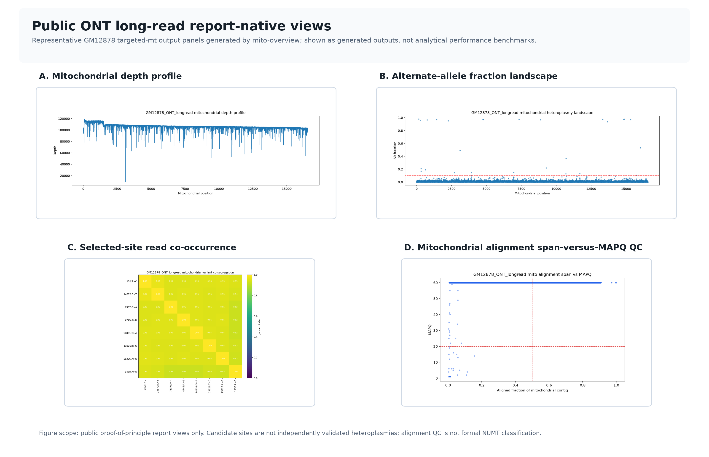
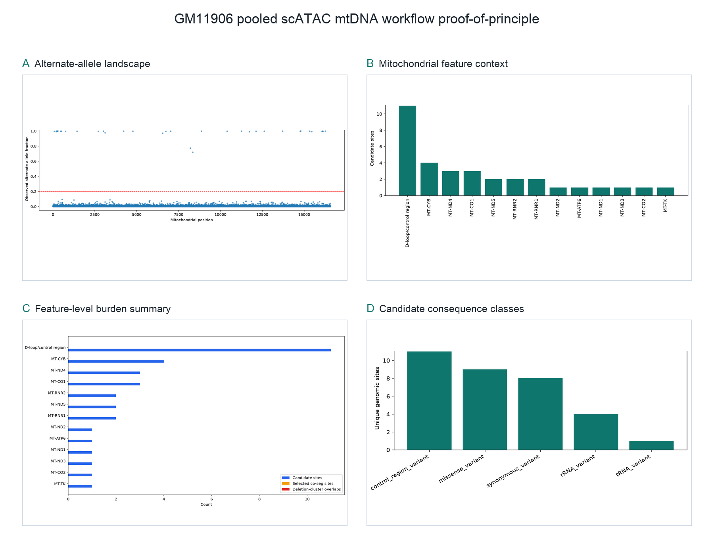

# mito-overview

`mito-overview` is a Python-based workflow for mode-gated mitochondrial DNA (mtDNA) evidence reporting from aligned BAM or CRAM inputs. The current public implementation provides a long-read-oriented profile and a reduced short-read compatibility profile that preserves the analytical layers applicable without long molecules or ONT methylation tracks. The repository emphasizes synchronized HTML, TSV, and figure generation for mitochondrial QC, alternate-allele screening, structural screening, an experimental within-sample mt:nuclear depth ratio when nuclear context is evaluable, feature annotation, same-read co-occurrence, and warning-oriented QC.

Version `0.3.0` defines the workflow/resource release described here. Its GitHub release protocol starts from seven identity-checked public FASTQs, reconstructs the pooled short-read or deterministic reduced long-read derivative and alignment on each validation platform, and then tests report execution, synchronized artifacts, mode/status gating, descriptive filter dependence, and fixed-input repeatability. The release protocol binds its source, distributions, audit ZIP, macOS and Ubuntu reproduction evidence, and CI records to one immutable commit. Zenodo, an archival DOI, and bioRxiv submission are outside this GitHub release contract.

## Scope
- aligned BAM or CRAM input
- mitochondrial subset extraction
- observed alternate-allele-fraction candidate screening
- CIGAR-deletion structural screening with a separate supplementary-alignment/`SA` summary
- experimental within-sample mt:nuclear depth ratio when nuclear context is evaluable
- mitochondrial feature and gene-level summarization
- reference-scope-gated alignment-ambiguity and circularity QC
- optional exploratory methylation summaries
- HTML, TSV, and figure outputs per analytical section

## Implemented read profiles
- `long`
  - intended for ONT-style mtDNA workflows
  - supports the full current report structure, including long-read-only layers such as CIGAR-deletion screening, same-read co-occurrence, NUMT/circularity warning pages, and exploratory methylation
  - when ONT bedmethyl sidecars are absent, the core long-read layers still run and the exploratory methylation page degrades to an explicit status-only report
- `short`
  - intended for short-read mtDNA-aligned inputs
  - retains the applicable core pages and writes explicit `not_applicable` pages for long-read-only layers
  - currently exercised in the public repository as an auxiliary compatibility path with a synthetic toy sample and one public proof-of-principle example

## Current implemented scope
The modules below are implemented in the public repository and exercised by the synthetic smoke-test and example-bundle workflow:
- portable config loading
- run layout and provenance writing
- mitochondrial asset extraction
- shared HTML report rendering
- `mito_qc`
- `mito_heteroplasmy`
- `mito_deletions`
- `mito_copy_number`
- `mito_feature_annotation` with configurable human mtDNA GTF input
- `mito_cosegregation`
- `mito_gene_summary`
- `mito_numt_qc`
- `mito_identity_qc`
- `mito_variant_consequence`
- `mito_phymer_haplogroup` (optional human haplogroup enrichment)
- `mito_mvtool_annotation` (optional human external annotation enrichment)
- `mito_circularity_qc`
- `mito_methylation_exploratory`
- final sync into a persistent report directory

Human mtDNA currently has the clearest public configuration path. Human-specific external annotation and haplogroup layers remain optional, and non-human use should be limited to the reference-driven core modules unless separately validated.

Automatic `whole_genome` reference scope is conservative: both the FASTA index and alignment sequence dictionary must independently match the same exact GRCh37, GRCh38, GRCm38, or GRCm39 chromosome-length profile, including the assembly-specific mitochondrial length and no additional contigs. Reduced, scaled, augmented, hybrid, discordant, or modified profiles cannot enable categorical interpretation, while mt-only references resolve to `mt_only`. BAM/CRAM mode is inferred from the filename suffix; the suffix, any explicit `SOURCE_ALIGN_MODE`, and the encoded HTS container must agree so renamed files cannot bypass format-specific index or reference checks. For CRAM, mitochondrial sequence MD5 identity is checked against the supplied FASTA even when no mitochondrial records are present. Categorical NUMT-warning output additionally requires complete usable read-stat fields and primary-alignment evidence; otherwise the report retains computable raw metrics and records `not_evaluable` with an explicit reason rather than zero-filling evidence.

The historical `primary_full_length_fraction` field is retained as a `0.x` compatibility name, but v0.3.0 calculates a near-complete aligned-reference fraction rather than molecule integrity. For each primary alignment, CIGAR `M`, `=`, and `X` bases contribute to aligned reference bases, while `D` and `N` do not; a record qualifies at `aligned_reference_bases / MT_LENGTH >= 0.90`. The report therefore labels this value “primary near-complete aligned-reference fraction.”

## Relationship to other mtDNA software
`mito-overview` is designed to complement, not replace, established mtDNA tools. Variant callers, haplogroup classifiers, annotation services, contamination/NUMT tools, and visualization resources remain the right primary tools for their respective tasks. The narrower contribution here is a local, per-sample, mode-gated report bundle that keeps active analyses, optional enrichments, and unsupported assay layers synchronized.

For a reviewer-facing comparison with MToolBox, mtDNA-Server, HaploGrep, Phy-Mer, mvTool/MSeqDR, MitoVisualize, Haplocheck, MitSorter, and related mtDNA caller workflows, see [`docs/related_software_landscape.md`](docs/related_software_landscape.md).

## Synthetic smoke-test dataset
The repository contains a small synthetic dataset for installation checks and public example generation:
- [`examples/synthetic_data/TOY-001`](examples/synthetic_data/TOY-001)

This dataset is intentionally small and deterministic. It is meant for:
- environment checks
- smoke testing
- generation of the public example output bundle

The repository also includes a short-read synthetic example bundle generated from the same tracked toy inputs:
- [`examples/expected_reports/TOY-SR-001_output`](examples/expected_reports/TOY-SR-001_output)

Optional human-only enrichment pages are exercised locally in this repository with bundled fixture resources:
- a tiny deterministic Phy-Mer vendor stand-in under [`tests/fixtures/mock_phymer_vendor`](tests/fixtures/mock_phymer_vendor)
- a local mvTool-style annotation fixture under [`tests/fixtures/mock_mvtool_annotations.json`](tests/fixtures/mock_mvtool_annotations.json)

## Report views
The lead figure below shows public ONT long-read report-native panels from the fixed GM12878 qn1000 asset pack.



The panels show depth, alternate-allele fractions, selected-site read co-occurrence, and alignment span-versus-MAPQ QC. These are descriptive workflow outputs from the fixed reduced input.

Regenerate the lead figure with `python scripts/build_workflow_architecture_figure.py`.

The repository also includes a complementary proof-of-principle montage from a pseudo-bulk formed by pooling three public GM11906 single-cell ATAC-seq libraries:



## Installation
Create the public environment:

```bash
conda env create -f environment.yml
conda activate mito-overview
python -m pip install .
```

List the canonical workflow steps:

```bash
python -m mito_overview.cli --list-steps
```

Run a dry plan using the included example config:

```bash
python -m mito_overview.cli \
  --config examples/configs/human_example.env \
  --dry-run
```

Run through the public shell wrapper:

```bash
./scripts/run_mito_pipeline.sh \
  --config examples/configs/human_example.env \
  --steps validate,stage
```

Run the local synthetic smoke test:

```bash
./tests/smoke_public_pipeline.sh
```

Run the short-read synthetic smoke test:

```bash
./tests/smoke_public_pipeline_shortread.sh
```

Run the long-read smoke test without methylation sidecars:

```bash
./tests/smoke_public_pipeline_longread_nomethyl.sh
```

Generate the synthetic public example bundle from the tracked toy inputs:

```bash
./scripts/build_public_example_bundle.sh \
  "${TMPDIR:-/tmp}/mito-overview-TOY-001-output"
```

Generate the synthetic short-read example bundle:

```bash
./scripts/build_public_shortread_example_bundle.sh \
  "${TMPDIR:-/tmp}/mito-overview-TOY-SR-001-output"
```

Run the public reduced short-read proof-of-principle example:

```bash
./scripts/run_public_shortread_validation_gm11906.sh \
  "$PWD/validation_outputs/GM11906_reduced_shortread"
```

Run the public long-read proof-of-principle example:

```bash
./scripts/run_public_longread_validation_gm12878.sh \
  "$PWD/validation_outputs/GM12878_ONT_longread"
```

## Output contract
Each finished sample bundle is expected to contain:
- a mitochondrial BAM for inspection
- per-step TSV summaries
- per-step figures
- per-step HTML report pages
- a final sample bundle for archival or downstream review

A synthetic public-core example bundle is staged at:
- [`examples/expected_reports/TOY-001_output`](examples/expected_reports/TOY-001_output)
- [`examples/expected_reports/TOY-SR-001_output`](examples/expected_reports/TOY-SR-001_output)

Pages `01` through `14` in the example bundle correspond to the currently ported public report pages. In the bundled toy smoke-test path, pages `13` and `14` are exercised through local fixture resources so that a fresh clone can exercise the optional human enrichment interfaces without a private Phy-Mer checkout or live network dependency.

In the short-read targeted-mt profile, pages `03`, `04`, `06`, `08`, `09`, `11`, `12`, and `13` are expected to be explicit status pages rather than active long-read analyses. In a short-read WGS profile, page `04` can report the experimental within-sample mt:nuclear depth ratio, but the long-read structural and molecule-level pages remain status-only.

In long-read mode without ONT bedmethyl sidecars, page `12` is expected to be a stable status-only methylation report while the core long-read analytical pages remain active.

## Optional integrations
- Phy-Mer: optional human mtDNA haplogroup enrichment
- mvTool: optional human mtDNA external annotation enrichment
- these integrations are intentionally non-mandatory and should be treated as secondary annotation layers rather than the core analysis
- mvTool is disabled by default; fixture or explicitly requested network success requires one unique returned row for every submitted candidate, with no missing, duplicate, or unexpected identifiers
- the repository's synthetic smoke-test path uses local fixtures to exercise these layers; real biological use should point to a true Phy-Mer vendor tree and an explicitly configured mvTool-compatible endpoint
- `mito-overview` does not bundle external Phy-Mer code or mvTool data resources; see [`docs/license_notes.md`](docs/license_notes.md)

## Repository status
- version 0.3.0 with a functional core, tracked synthetic smoke-test assets, and an active software/resource preprint draft
- current repository now includes a synthetic public example bundle generated from the public-core workflow
- current repository now includes a short-read synthetic bundle plus bounded public long-read and short-read proof-of-principle asset packs
- cite the software metadata in [`CITATION.cff`](CITATION.cff) and use tagged releases for archived versions
- canonical free-format manuscript source is [`paper/preprint_draft.md`](paper/preprint_draft.md)
- design notes for the public package are in [`docs/overview.md`](docs/overview.md) and [`docs/methodology.md`](docs/methodology.md)
- public long-read proof-of-principle notes are in [`docs/validation_public_longread.md`](docs/validation_public_longread.md)
- public reduced short-read proof-of-principle notes are in [`docs/validation_public_shortread.md`](docs/validation_public_shortread.md)
- release-readiness requirements are in [`docs/release_checklist.md`](docs/release_checklist.md)
- related-software positioning is in [`docs/related_software_landscape.md`](docs/related_software_landscape.md)
- the current reproducibility evidence ledger is in [`docs/reproducibility_run_ledger.md`](docs/reproducibility_run_ledger.md)
- contribution and issue-reporting guidance is in [`CONTRIBUTING.md`](CONTRIBUTING.md)

## Public long-read reduced-input example
The repository includes an asset pack from a fixed deterministic subset of a public ONT targeted-mt run:
- [`examples/public_validation/GM12878_ONT_longread`](examples/public_validation/GM12878_ONT_longread)

This example uses the public GM12878 targeted-mt ONT dataset reported by Vandiver et al. (2022), BioProject `PRJNA809571` / run `SRR18110025`, described as `Long read mitochondrial genome sequencing using Cas9-guided adaptor ligation`:
- [Vandiver et al., Mitochondrion 2022, PMCID PMC9399971](https://pmc.ncbi.nlm.nih.gov/articles/PMC9399971/)
- [NCBI BioProject PRJNA809571](https://www.ncbi.nlm.nih.gov/bioproject/PRJNA809571)
- [ENA run SRR18110025](https://www.ebi.ac.uk/ena/browser/view/SRR18110025)

The v0.3.0 release protocol selects exactly the `1,000` smallest seeded query-name hashes from `193,043` source FASTQ records, then aligns that reconstructed subset to `NC_012920.1` with minimap2 `2.31-r1302`. The expected mapped-only derivative has `728` mapped unique query names represented by `728` primary alignments and `543` supplementary records.

With `MIN_CALLABLE_DEPTH=100`, `MIN_ALT_ALLELE_FRACTION=0.10`, and default BaseQ/MAPQ/readQ filters `13/20/10`, the v0.3.0 validation oracle expects `16` candidates, `7,143,152` accepted observations, and `2,047,476` excluded observations. The structural screen expects `13` singleton CIGAR-deletion bins, each supported by one query name; separately, `542` query names are expected to have a supplementary alignment or `SA` tag. Prescribed statuses are `not_applicable` for the within-sample mt:nuclear depth ratio and Phy-Mer, `not_configured` for mvTool and methylation, and `not_evaluable` for NUMT interpretation with `reference_scope_mt_only`. Final exact-commit observed values and commit-bound provenance will be distributed in the GitHub release validation packet; until that packet passes, these values remain frozen oracle expectations with local provisional supporting observations.

| GM12878 profile | BaseQ/MAPQ/readQ | Candidates | Accepted observations |
| --- | --- | ---: | ---: |
| lenient | `0/0/0` | 32 | 8,278,969 |
| default | `13/20/10` | 16 | 7,143,152 |
| strict | `20/30/15` | 15 | 6,046,355 |

Each clean-room platform matrix independently reconstructs the seeded subset and alignment from the sealed raw FASTQ. The two default report invocations within that matrix use the same newly generated derivative so their normalized scientific tables can be compared without conflating report repeatability with a second alignment. See [`docs/validation_public_longread.md`](docs/validation_public_longread.md) for the evidence scope.

## Complementary short-read compatibility example
The repository also includes an asset pack from a fixed public short-read input:
- [`examples/public_validation/GM11906_MERRF_shortread`](examples/public_validation/GM11906_MERRF_shortread)

This example pools paired-end reads from three single-cell ATAC-seq libraries derived from the same GM11906 lymphoblastoid line. It is a short-read compatibility exercise, not short-read WGS, a bulk assay, or a three-patient cohort. Because the libraries contribute unequal callable read depth, pooled allele fractions are read-observation weighted rather than equal-weight per-cell summaries:
- [Lareau et al., Nat Biotechnol 2021](https://www.nature.com/articles/s41587-020-0645-6)
- [GEO `GSM4238454` / `SRR10804585`](https://www.ncbi.nlm.nih.gov/geo/query/acc.cgi?acc=GSM4238454)
- [GEO `GSM4238459` / `SRR10804590`](https://www.ncbi.nlm.nih.gov/geo/query/acc.cgi?acc=GSM4238459)
- [GEO `GSM4238526` / `SRR10804657`](https://www.ncbi.nlm.nih.gov/geo/query/acc.cgi?acc=GSM4238526)
- [Coriell GM11906](https://www.coriell.org/0/Sections/Search/Sample_Detail.aspx?Ref=GM11906)

The MitoOverview run uses `READ_MODE=short` and the `ASSAY_TYPE=targeted_mt` report profile because the regenerated alignment contains only mtDNA. With `MIN_CALLABLE_DEPTH=10`, `MIN_ALT_ALLELE_FRACTION=0.20`, and default BaseQ/MAPQ/readQ filters `13/20/10`, the v0.3.0 validation oracle expects `33` candidates, `44,048,838` accepted observations, and `7,296,932` excluded observations. Overlapping mates contribute at most one representative fragment observation per position: observations are ranked by BaseQ and MAPQ, discordant top-quality ties are excluded as ambiguous, and concordant ties use read 1, then read 2, then a stable alignment key. Forward/reverse counts therefore describe representative fragments after overlap suppression, not independent support from both mates. The `m.8344A>G` row is expected at depth `1,027`, with alternate count `740`, observed alternate allele fraction `0.720545`, and `MT-TK` / `tRNA_variant` annotation. This fraction is calculated across pooled passing read observations and is not a per-cell or independently calibrated sample heteroplasmy estimate. Final exact-commit observed values and commit-bound provenance will be distributed in the GitHub release validation packet; until that packet passes, these values remain frozen oracle expectations with local provisional supporting observations.

| GM11906 profile | BaseQ/MAPQ/readQ | Candidates | Accepted observations |
| --- | --- | ---: | ---: |
| lenient | `0/0/0` | 33 | 44,048,838 |
| default | `13/20/10` | 33 | 44,048,838 |
| strict | `20/30/15` | 33 | 42,675,832 |

Each clean-room platform matrix reconstructs the pooled paired FASTQs and BWA alignment from the six sealed accession FASTQs. The two default report invocations within that matrix use the same newly generated derivative for normalized-table comparison. See [`docs/validation_public_shortread.md`](docs/validation_public_shortread.md) for the evidence scope.

## Preprint
A software/resource preprint is in preparation. A citation link and versioned preprint reference will be added here when posted.
