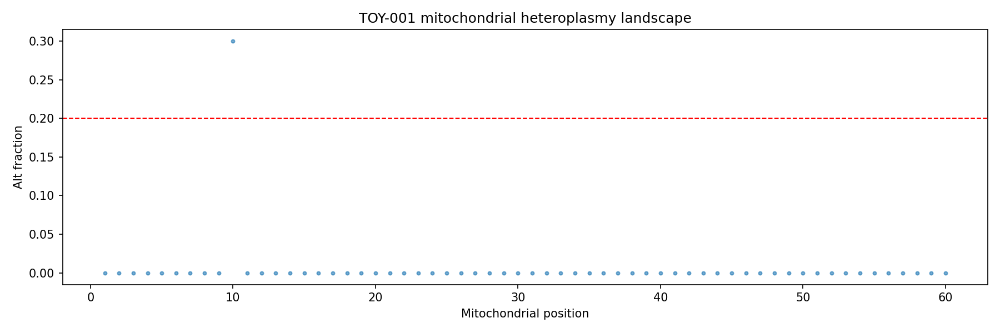
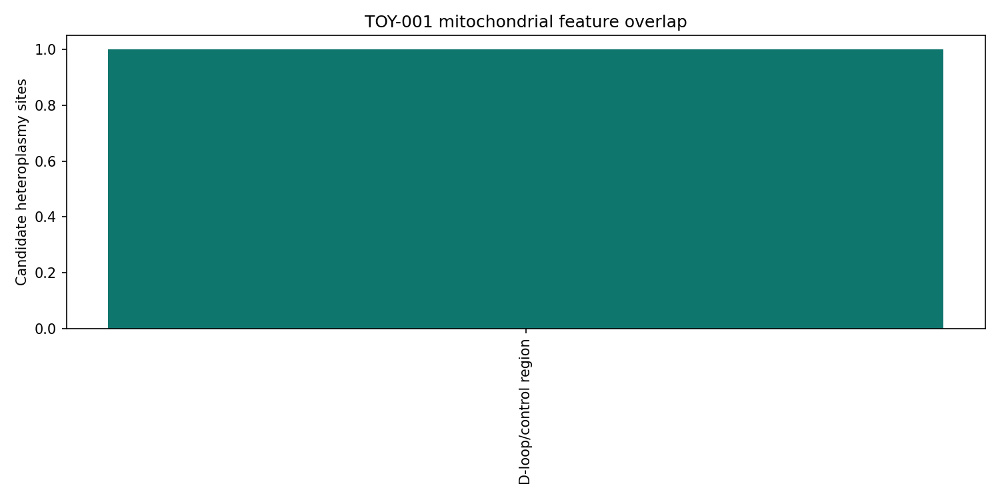
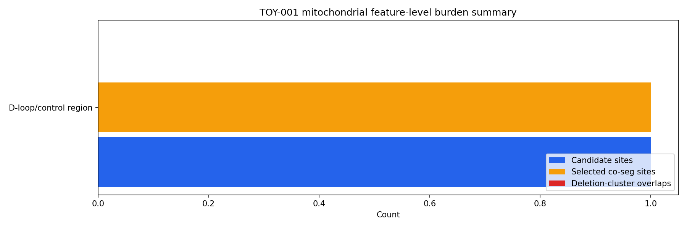
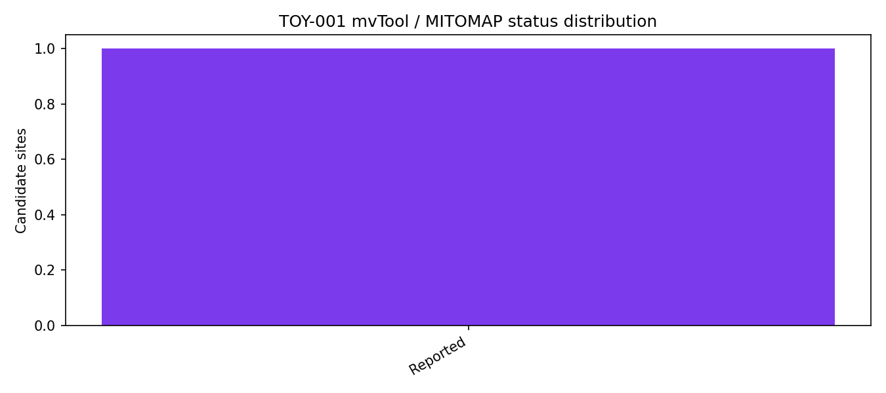

# mito-overview

`mito-overview` is a Python-based workflow for mitochondrial DNA analysis from aligned BAM or CRAM inputs. The current public implementation is centered on a long-read-oriented profile derived from an internally exercised ONT mtDNA reporting workflow, with an auxiliary reduced short-read compatibility profile that preserves only the analytical layers that remain interpretable without long molecules or ONT methylation tracks. The repository emphasizes stepwise mitochondrial QC, heteroplasmy screening, deletion screening, copy-number proxy estimation, feature annotation, and report generation.

## Scope
- aligned BAM or CRAM input
- mitochondrial subset extraction
- heteroplasmy screening
- deletion and rearrangement screening
- mtDNA depth and copy-number proxy estimation
- mitochondrial feature and gene-level summarization
- NUMT-aware and circularity-aware QC
- optional exploratory methylation summaries
- HTML, TSV, and figure outputs per analytical section

## Implemented read profiles
- `long`
  - intended for ONT-style mtDNA workflows
  - supports the full current report structure, including long-read-only layers such as deletion screening, co-segregation, NUMT/circularity warning pages, and exploratory methylation
- `short`
  - intended for short-read mtDNA-aligned inputs
  - retains the applicable core pages and writes explicit `not_applicable` pages for long-read-only layers
  - currently exercised in the public repository as an auxiliary compatibility path with a synthetic toy sample and one public proof-of-principle example

## Current implemented scope
The public mirror currently covers the working core already ported from the internal pipeline. The modules below are implemented in the public mirror and exercised by the current synthetic smoke-test and example-bundle workflow:
- portable config loading
- run layout and provenance writing
- mitochondrial asset extraction
- shared HTML report rendering
- `mito_qc`
- `mito_heteroplasmy`
- `mito_deletions`
- `mito_copy_number`
- `mito_feature_annotation` with configurable human mtDNA GTF input
- `mito_cosegregation`
- `mito_gene_summary`
- `mito_numt_qc`
- `mito_identity_qc`
- `mito_variant_consequence`
- `mito_phymer_haplogroup` (optional human haplogroup enrichment)
- `mito_mvtool_annotation` (optional human external annotation enrichment)
- `mito_circularity_qc`
- `mito_methylation_exploratory`
- final sync into a persistent report directory

Human mtDNA currently has the clearest public configuration path. Human-specific external annotation and haplogroup layers remain optional, and non-human use should be limited to the reference-driven core modules unless separately validated.

## Synthetic validation dataset
The repository contains a small synthetic dataset for installation checks and public example generation:
- [`examples/synthetic_data/TOY-001`](examples/synthetic_data/TOY-001)

This dataset is intentionally small and deterministic. It is meant for:
- environment validation
- smoke testing
- generation of the public example output bundle

The repository also includes a short-read synthetic example bundle generated from the same tracked toy inputs:
- [`examples/expected_reports/TOY-SR-001_output`](examples/expected_reports/TOY-SR-001_output)

Optional human-only enrichment pages are validated locally in this repository with bundled fixture resources:
- a tiny deterministic Phy-Mer vendor stand-in under [`tests/fixtures/mock_phymer_vendor`](tests/fixtures/mock_phymer_vendor)
- a local mvTool-style annotation fixture under [`tests/fixtures/mock_mvtool_annotations.json`](tests/fixtures/mock_mvtool_annotations.json)

The corresponding expected public example output bundle is:
- [`examples/expected_reports/TOY-001_output`](examples/expected_reports/TOY-001_output)
- [`examples/expected_reports/TOY-SR-001_output`](examples/expected_reports/TOY-SR-001_output)

## Representative report views
These panels come from a synthetic public-core example bundle generated from the repository's own example-builder workflow.

**Heteroplasmy landscape**



**Feature annotation overview**



**Gene-level summary**



**Optional annotation context**



## Installation
Create the public environment:

```bash
conda env create -f environment.yml
conda activate mito-overview
```

List the canonical workflow steps:

```bash
python -m mito_overview.cli --list-steps
```

Run a dry plan using the included example config:

```bash
python -m mito_overview.cli \
  --config examples/configs/human_example.env \
  --dry-run
```

Run through the public shell wrapper:

```bash
./scripts/run_mito_pipeline.sh \
  --config examples/configs/human_example.env \
  --steps validate,stage
```

Run the local synthetic smoke test:

```bash
./tests/smoke_public_pipeline.sh
```

Run the short-read synthetic smoke test:

```bash
./tests/smoke_public_pipeline_shortread.sh
```

Generate the synthetic public example bundle from the tracked toy inputs:

```bash
./scripts/build_public_example_bundle.sh \
  examples/expected_reports/TOY-001_output
```

Generate the synthetic short-read example bundle:

```bash
./scripts/build_public_shortread_example_bundle.sh \
  examples/expected_reports/TOY-SR-001_output
```

Run the public short-read proof-of-principle example:

```bash
./scripts/run_public_shortread_validation_gm11906.sh \
  /tmp/GM11906_MERRF_shortread_output
```

## Output contract
Each finished sample bundle is expected to contain:
- a mitochondrial BAM for inspection
- per-step TSV summaries
- per-step figures
- per-step HTML report pages
- a final sample bundle for archival or downstream review

A synthetic public-core example bundle is staged at:
- [`examples/expected_reports/TOY-001_output`](examples/expected_reports/TOY-001_output)
- [`examples/expected_reports/TOY-SR-001_output`](examples/expected_reports/TOY-SR-001_output)

Pages `01` through `14` in the example bundle correspond to the currently ported public report pages. In the bundled toy validation path, pages `13` and `14` are exercised through local fixture resources so that a fresh clone can validate the optional human enrichment layers without a private Phy-Mer checkout or live network dependency.

In the short-read profile, pages `03`, `04`, `06`, `08`, `09`, `11`, `12`, and, for targeted mtDNA assays, `13` are expected to be explicit status pages rather than active long-read analyses.

## Optional integrations
- Phy-Mer: optional human mtDNA haplogroup enrichment
- mvTool: optional human mtDNA external annotation enrichment
- these integrations are intentionally non-mandatory and should be treated as secondary annotation layers rather than the core analysis
- the repository's synthetic validation path uses local fixtures for these layers; real biological use should point to a true Phy-Mer vendor tree and the intended mvTool-compatible endpoint
- `mito-overview` does not bundle external Phy-Mer code or mvTool data resources; see [`docs/license_notes.md`](docs/license_notes.md)

## Repository status
- public repository with a functional core, tracked synthetic validation assets, and an active software/resource preprint draft
- current repository now includes a synthetic public example bundle generated from the public-core workflow
- current repository now includes a short-read synthetic bundle and an auxiliary public short-read compatibility example asset pack
- cite the software metadata in [`CITATION.cff`](CITATION.cff) (current version `0.2.0`) until a manuscript and/or DOI is posted
- design notes for the public package are in [`docs/overview.md`](docs/overview.md) and [`docs/methodology.md`](docs/methodology.md)
- short-read validation notes are in [`docs/validation_public_shortread.md`](docs/validation_public_shortread.md)

## Auxiliary short-read compatibility example
The repository includes a light-weight asset pack from a real public short-read proof-of-principle example:
- [`examples/public_validation/GM11906_MERRF_shortread`](examples/public_validation/GM11906_MERRF_shortread)

This example uses public GM11906 short-read ATAC-seq runs from the dscATAC-seq study by Lareau and colleagues together with public GM11906 metadata describing the cell line as carrying pathogenic `m.8344A>G`:
- [Lareau et al., Nat Biotechnol 2019](https://www.nature.com/articles/s41587-019-0147-6)
- [GEO sample metadata example](https://www.ncbi.nlm.nih.gov/geo/query/acc.cgi?acc=GSM4238489)
- [Coriell GM11906](https://www.coriell.org/0/Sections/Search/Sample_Detail.aspx?Ref=GM11906)
- [ClinVar m.8344A>G](https://www.ncbi.nlm.nih.gov/clinvar/RCV000010192.15/)

The short-read profile is run in `READ_MODE=short` and `ASSAY_TYPE=targeted_mt`, which intentionally preserves the applicable core pages and marks long-read-specific layers as `not_applicable` rather than attempting to reinterpret them. In the bundled proof-of-principle run, the workflow recovers the expected `m.8344A>G` site in the pooled mt-only alignment with depth `1041`, alt count `754`, estimated heteroplasmy fraction `0.724304`, and `MT-TK` / `tRNA_variant` annotation.

This example is included to demonstrate real-data execution and site recovery under the reduced short-read profile. It is not presented as a modality-matched benchmark for deletion calling, NUMT discrimination, copy-number estimation, or clinical heteroplasmy calibration.


## Preprint
A software/resource preprint is in preparation. A citation link and versioned preprint reference will be added here when posted.
