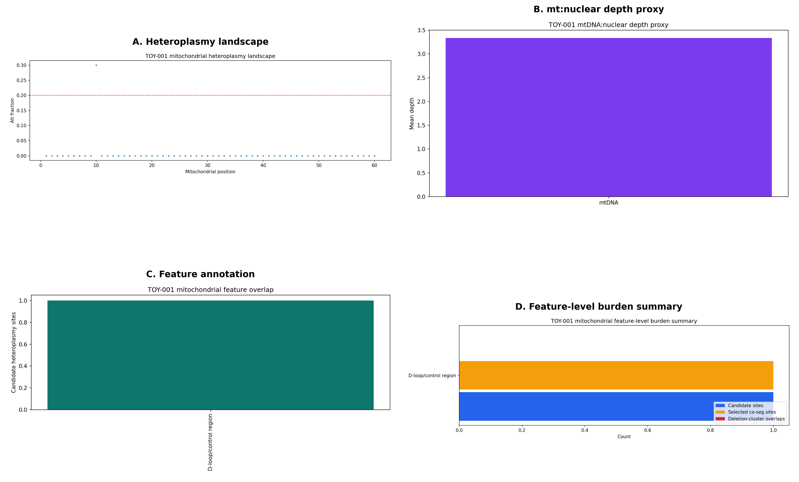
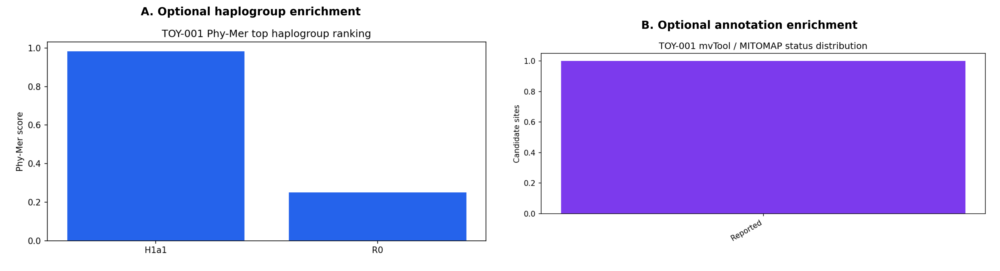
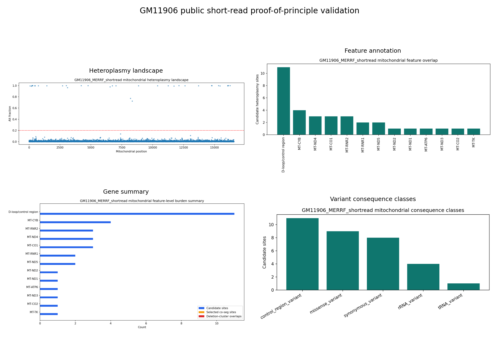

# mito-overview: a modular long-read mitochondrial DNA interpretation and reporting framework

## Running title
`mito-overview` for long-read mtDNA interpretation

## Author
Elisson Lopes

## Affiliation
Affiliation to be finalized before submission

## Correspondence
Correspondence details to be finalized before submission

## Software version
This draft describes `mito-overview` version `0.2.0` at [elissonnog/mito-overview](https://github.com/elissonnog/mito-overview).

## Abstract
Mitochondrial DNA analysis from Oxford Nanopore Technologies (ONT) data often remains fragmented across single-purpose callers, external annotation resources, and custom review steps. This fragmentation is especially limiting for long-read mitochondrial workflows because interpretation may depend not only on variant presence, but also on deletion structure, mtDNA burden proxies, read-level co-segregation, circular-genome edge effects, and quality signals relevant to nuclear mitochondrial DNA segments (NUMTs). We developed `mito-overview`, a modular mtDNA interpretation and reporting framework that converts aligned ONT mitochondrial inputs into layered tabular summaries, figures, and self-contained HTML reports. The current core implementation includes mitochondrial extraction, QC, heteroplasmy summarization, deletion screening, mt:nuclear depth proxy estimation, feature annotation, co-segregation, gene-level aggregation, NUMT-aware QC, identity QC, variant consequence summaries, circularity-aware QC, and an exploratory methylation layer. Two additional human-only enrichment layers are implemented for haplogroup classification and external mtDNA annotation through optional Phy-Mer and mvTool integrations validated in the repository with local fixtures. The repository provides a command-line entry point, environment specification, tracked synthetic validation inputs, a synthetic example output bundle, and reproducible regeneration of report pages `01` through `14`. `mito-overview` is intended as a disease-agnostic research framework for ONT mtDNA evidence synthesis and report generation rather than as a clinical diagnostic test.

## Keywords
mitochondrial DNA; Oxford Nanopore; heteroplasmy; deletions; NUMT; haplogroup; reporting workflow; bioinformatics software

## Introduction
Human mitochondrial DNA (mtDNA) is a small circular genome whose interpretation is biologically and technically distinct from standard linear nuclear analysis. Disease-relevant signal can arise through heteroplasmic single-nucleotide variants, large deletions or rearrangements, mtDNA burden differences, and molecule-level structure. At the same time, interpretation can be distorted by extreme depth, circular-reference edge effects, and nuclear mitochondrial DNA segments (NUMTs), the latter of which can generate pseudo-heteroplasmy if they are not handled carefully [1,2]. Oxford Nanopore Technologies (ONT) long reads are well suited to this context because they preserve molecule-scale information and can improve structural interpretation, but they also increase the number of analytical layers that need to be reviewed coherently [3-6].

The current mtDNA software ecosystem includes specialized resources for haplogroup classification, variant interpretation, and annotated mtDNA reporting. Examples include Phy-Mer for alignment-free haplogroup classification [7], HaploGrep 3 for phylogenetic classification and QC [8], mvTool within MSeqDR for mtDNA annotation and nomenclature handling [9], MitoVisualize for structure-aware mtDNA interpretation [10], MToolBox for automated mtDNA reconstruction and prioritization [11], and mtDNA-Server 2 for human mtDNA variant analysis and interactive reporting [12]. ONT-focused analysis tools are also emerging for long-read heteroplasmy analysis and NUMT-aware read discrimination [6,13]. However, there remains a need for a compact sample-level workflow that integrates multiple ONT-relevant layers into one report bundle while remaining reproducible, inspectable, and portable.

`mito-overview` was developed to address that need. It is not intended to replace specialized mtDNA tools or to serve as a best-in-class caller for each event type. Instead, it provides a modular long-read mtDNA evidence-synthesis and reporting framework that organizes long-read-aware analytical layers into one machine-readable and human-readable sample bundle.

## Software scope and design principles
`mito-overview` was designed around five principles.

First, each analytical question is implemented as an independent step that writes its own summaries, figures, and report page. Second, report generation is paired with TSV outputs so that visual review does not come at the expense of downstream reuse. Third, provenance is carried explicitly, including the reference build, mitochondrial contig name, threshold settings, and input-source tracing. Fourth, the reproducible public core is kept separate from optional human-specific enrichments that depend on external tools or services. Fifth, the methylation layer is retained as exploratory context rather than elevated to a primary biological or diagnostic claim, consistent with ongoing caution in the mtDNA methylation literature [14,15].

## Implementation and workflow
The workflow is driven by an environment-style configuration and accepts aligned BAM or CRAM inputs from which mitochondrial reads can be extracted. Configuration records the sample identifier, reference build, mitochondrial contig, thresholds, output paths, and optional integration settings. The public repository packages the workflow as a Python-based framework with a shell runner, CLI entry point, example configuration, smoke test, and reproducible example-bundle builder.

The current implemented workflow consists of 18 steps: `validate`, `stage`, `extract`, 14 analytical/reporting steps, and `sync_bioinfo`. Of the 14 report-generating analytical steps, 12 comprise the general public-core analysis and 2 are optional human-only enrichment layers. The 12 public-core analytical pages are:

1. mitochondrial QC
2. heteroplasmy
3. deletion screening
4. mt:nuclear depth proxy
5. mitochondrial feature annotation
6. co-segregation
7. gene summary
8. NUMT-aware QC
9. identity QC
10. variant consequence summary
11. circularity-aware QC
12. exploratory methylation

Two optional human-only enrichment pages are also implemented and, in the public repository, are validated through local fixtures rather than live external resources:

13. Phy-Mer haplogroup classification
14. mvTool-style external mtDNA annotation

The core pages are intended to run without external network services. For real-world use, the optional pages depend on the underlying external resources and their terms or availability.

## Public validation assets
The public repository includes tracked synthetic validation inputs (`TOY-001`), a regeneration script for the public example bundle, and an end-to-end smoke workflow that exercises the full public step chain. The public validation path includes:

- `python -m mito_overview.cli --list-steps`
- `./tests/smoke_public_pipeline.sh`
- `./scripts/build_public_example_bundle.sh`

These validations were run successfully from the local source tree and from a fresh GitHub clone using the packaged environment. The tracked example bundle currently contains report pages `01` through `14`, corresponding figures, TSV outputs, methylation track tables, and subset assets. Analytical TSV, HTML, and figure outputs are intended to remain stable across rebuilds. The bundled mitochondrial BAM and BAM index are included for reproducibility and inspection, but byte-level identity is not guaranteed across rebuilds because compression and indexing can vary by environment.

The public validation is therefore workflow-level and reproducibility-oriented, not a substitute for cohort-scale benchmark evaluation. The synthetic dataset is intentionally minimal and is designed to validate installation, step connectivity, and output contracts rather than biological realism.

The repository also includes an auxiliary short-read proof-of-principle compatibility example. This example pools three public GM11906 scATAC-seq runs from the dscATAC-seq study of Lareau and colleagues [16], uses public metadata describing GM11906 as a lymphoblastoid cell line carrying pathogenic `m.8344A>G` [17,18], and executes the workflow in `READ_MODE=short` with `ASSAY_TYPE=targeted_mt`. Under this reduced profile, long-read-specific layers are emitted as explicit `not_applicable` pages while the applicable core layers remain active. In the bundled example output, the workflow recovers the expected `m.8344A>G` site in the pooled mt-only alignment with depth `1041`, alternate count `754`, estimated heteroplasmy fraction `0.724304`, and `MT-TK` / `tRNA_variant` annotation. This example is included to demonstrate real-data execution and representation of a known pathogenic site under the reduced short-read profile; it is not presented as cohort-scale, modality-matched, or clinical validation.

## Relation to current ONT mtDNA evidence
Current published evidence most directly supports ONT mtDNA analysis for structural mtDNA interpretation and moderate-frequency heteroplasmy analysis. Long-read sequencing has been shown to improve detection and interpretation of mtDNA deletions and rearrangements, including cases where apparent single-deletion events resolve into more complex structures under long-read inspection [3,4]. A recent ONT heteroplasmy validation study reported strong agreement for moderate-level heteroplasmy but also emphasized the need for stringent validation, with a practical detection limit around 12% [5].

These observations inform the intended use boundaries of `mito-overview`. In its current form, the framework is intended to organize long-read-aware QC, heteroplasmy summaries, deletion screening, mtDNA burden context, and report generation. It is not presented here as a validated low-VAF diagnostic caller. Likewise, the methylation page is retained as an exploratory context layer only. This is consistent with studies that found no evidence for biologically meaningful CpG methylation in human mtDNA by single-molecule ONT analysis and no evidence for extensive non-CpG mtDNA methylation in reanalysis studies [14,15].

NUMT-aware interpretation further emphasizes the need for a dedicated mtDNA workflow rather than simple variant listing. NUMTs are widespread and dynamic in human genomes [1], and published reinterpretations have shown that apparent mtDNA findings can change after better NUMT-aware review [2]. Recent tools such as MitSorter reinforce the value of explicit read-level discrimination strategies in the ONT setting [13]. In `mito-overview`, this motivates dedicated NUMT-aware and circularity-aware QC pages that are reported as separate warning-oriented interpretive layers.

## Results and current release scope
The current version of `mito-overview` produces a modular sample-level mtDNA report bundle from tracked synthetic inputs with reproducible end-to-end execution. The public-core workflow produces 12 analytical pages, and the optional enrichment boundary extends that to 14 pages when human-only Phy-Mer and mvTool-style integrations are enabled.

The public implementation is now executable end-to-end in the repository. The optional enrichment layers have been ported into the public codebase with fixture-based validation, which allows the full report structure to be exercised without private project dependencies. The repository also includes an environment definition, synthetic validation inputs, a smoke test, a reproducible example-bundle builder, tracked example outputs, and documentation that distinguishes public-core logic from optional external integrations.

## Example figures
### Figure 1. Public-core analytical views from the tracked synthetic example bundle

The tracked `TOY-001` example bundle demonstrates the report structure of the public core. Shown here are representative views for heteroplasmy landscape, mt:nuclear depth proxy, mitochondrial feature annotation, and feature-level burden summary. These panels are generated from the version-controlled synthetic example outputs bundled in the repository and are intended to document report structure and reproducible rendering rather than biological effect size.

### Figure 2. Optional human-only enrichment views validated through local fixtures

The public repository also validates two optional human-specific enrichment layers using local fixtures during smoke testing. The left panel shows the optional haplogroup-ranking view, and the right panel shows the optional annotation-status view. In applied analyses, these layers are intended to connect to live external resources rather than the bundled validation fixtures.

### Figure 3. Auxiliary short-read proof-of-principle compatibility example from pooled public GM11906 scATAC-seq runs

This auxiliary figure summarizes the reduced short-read profile applied to pooled public GM11906 data. The panels show the short-read heteroplasmy landscape together with mitochondrial feature annotation, feature-level gene summary, and variant consequence summary from the public asset pack bundled in the repository. This example is intended to show real-data execution and recovery/reporting of the known `m.8344A>G` site under the mt-only short-read profile. It is not intended to establish modality-matched validation for long-read-only layers such as deletion screening, co-segregation, NUMT discrimination, or circularity-aware review.

## Discussion
`mito-overview` is a software/resource contribution for ONT mtDNA evidence synthesis and reporting. Its main contribution lies in modular integration, explicit long-read-aware interpretation layers, and a reproducible public-core implementation. The workflow is therefore complementary to existing mtDNA utilities rather than a replacement for each specialized tool.

## Availability and implementation
Repository:
- [elissonnog/mito-overview](https://github.com/elissonnog/mito-overview)

Implementation assets currently available in the public repository include:
- Python package modules for the workflow and report generation
- shell runner and HPC-oriented wrapper separation
- `environment.yml`
- `pyproject.toml`
- `CITATION.cff`
- tracked synthetic validation inputs
- tracked synthetic example outputs
- smoke-test workflow
- example-bundle regeneration script
- MIT license for the public core repository

Optional external enrichments such as Phy-Mer and mvTool are intentionally kept as optional dependencies rather than bundled redistributable components.

## Limitations and future work
The current release has clear boundaries. Public validation is synthetic and workflow-oriented rather than cohort-scale. Copy-number remains a depth proxy rather than an absolute mtDNA copy-number estimate. Deletion output is a structural screen driven by alignment structure rather than a specialized SV caller. NUMT and circularity components are warning-oriented QC layers, not formal classifiers. The clearest validated path is currently human mtDNA, and the optional enrichment modules remain human-only.

The auxiliary short-read example has additional limits. It uses pooled public scATAC-seq runs aligned directly to the mitochondrial reference and therefore supports only a reduced `READ_MODE=short` profile. It should be interpreted as a compatibility example for real-data execution and site recovery, not as a full short-read validation study or a calibrated heteroplasmy benchmark.

Immediate next steps before journal submission include:
- adding cohort-scale quantitative validation tables
- benchmarking selected outputs against specialized external tools where appropriate
- adding manuscript-ready workflow and report figures
- clarifying versioned release metadata and DOI minting
- extending validated support beyond the current human-focused path

A second future direction is downstream classifier work using `mito-overview` outputs as engineered features. That problem is intentionally outside the scope of the current software/resource paper, which is centered on report generation, reproducible workflow structure, and ONT-aware mtDNA interpretation.

## References
1. Wei W, et al. Nuclear-embedded mitochondrial DNA sequences in 66,083 human genomes. *Nature*. 2022. [PubMed](https://pubmed.ncbi.nlm.nih.gov/36198798/)
2. Fleischmann Z, et al. Reanalysis of mtDNA mutations of human primordial germ cells (PGCs) reveals NUMT contamination and suggests that selection in PGCs may be positive. *Mitochondrion*. 2024. [PubMed](https://pubmed.ncbi.nlm.nih.gov/37914096/)
3. Frascarelli C, et al. Nanopore long-read next-generation sequencing for detection of mitochondrial DNA large-scale deletions. *Front Genet*. 2023. [PubMed](https://pubmed.ncbi.nlm.nih.gov/37456669/)
4. Lopriore E, et al. An inherited mtDNA rearrangement, mimicking a single large-scale deletion, associated with MIDD and a primary cardiological phenotype. *Mitochondrion*. 2025. [PubMed](https://pubmed.ncbi.nlm.nih.gov/40164291/)
5. Slapnik B, et al. The quality and detection limits of mitochondrial heteroplasmy by long read nanopore sequencing. *Sci Rep*. 2024. [Nature](https://www.nature.com/articles/s41598-024-78270-0)
6. Jiang L, et al. CmVCall: An automated and adjustable nanopore analysis pipeline for heteroplasmy detection of the control region in human mitochondrial genome. *Forensic Sci Int Genet*. 2023. [PubMed](https://pubmed.ncbi.nlm.nih.gov/37595417/)
7. Navarro-Gomez D, et al. Phy-Mer: a novel alignment-free and reference-independent mitochondrial haplogroup classifier. *Bioinformatics*. 2015. [PubMed](https://pubmed.ncbi.nlm.nih.gov/25505086/)
8. Schönherr S, et al. HaploGrep 3 - an interactive haplogroup classification and analysis platform. *Nucleic Acids Res*. 2023. [PubMed](https://pubmed.ncbi.nlm.nih.gov/37070190/)
9. Shen L, et al. MSeqDR mvTool: a mitochondrial DNA web and API resource for comprehensive variant annotation, universal nomenclature collation, and reference genome conversion. *Hum Mutat*. 2018. [PMC](https://pmc.ncbi.nlm.nih.gov/articles/PMC5992054/)
10. Lake NJ, et al. MitoVisualize: a resource for analysis of variants in human mitochondrial RNAs and DNA. *Bioinformatics*. 2022. [PubMed](https://pubmed.ncbi.nlm.nih.gov/35561159/)
11. Calabrese C, et al. MToolBox: a highly automated pipeline for heteroplasmy annotation and prioritization analysis of human mitochondrial variants in high-throughput sequencing. *Bioinformatics*. 2014. [PubMed](https://pubmed.ncbi.nlm.nih.gov/25028726/)
12. Weissensteiner H, et al. mtDNA-Server 2: advancing mitochondrial DNA analysis through highly parallelized data processing and interactive analytics. *Nucleic Acids Res*. 2024. [PubMed](https://pubmed.ncbi.nlm.nih.gov/38709886/)
13. Cox SN, et al. MitSorter: a standalone tool for accurate discrimination of mtDNA and NuMT ONT reads based on differential methylation. *Bioinformatics Advances*. 2025. [PubMed](https://pubmed.ncbi.nlm.nih.gov/40688360/)
14. Bicci I, et al. Single-molecule mitochondrial DNA sequencing shows no evidence of CpG methylation in human cells and tissues. *Nucleic Acids Res*. 2021. [PubMed](https://pubmed.ncbi.nlm.nih.gov/34850165/)
15. Guitton R, et al. No evidence of extensive non-CpG methylation in mtDNA. *Nucleic Acids Res*. 2022. [PubMed](https://pubmed.ncbi.nlm.nih.gov/35979955/)
16. Lareau CA, Duarte FM, Chew JG, et al. Droplet-based combinatorial indexing for massive-scale single-cell chromatin accessibility. *Nat Biotechnol*. 2019. [Nature](https://www.nature.com/articles/s41587-019-0147-6)
17. Shoffner JM, Lott MT, Lezza AMS, et al. Myoclonic epilepsy and ragged-red fiber disease (MERRF) is associated with a mitochondrial DNA tRNA(Lys) mutation. *Cell*. 1990. [PubMed](https://pubmed.ncbi.nlm.nih.gov/2112427/)
18. Coriell Institute for Medical Research. GM11906 sample record. [Coriell](https://www.coriell.org/0/Sections/Search/Sample_Detail.aspx?Ref=GM11906)
