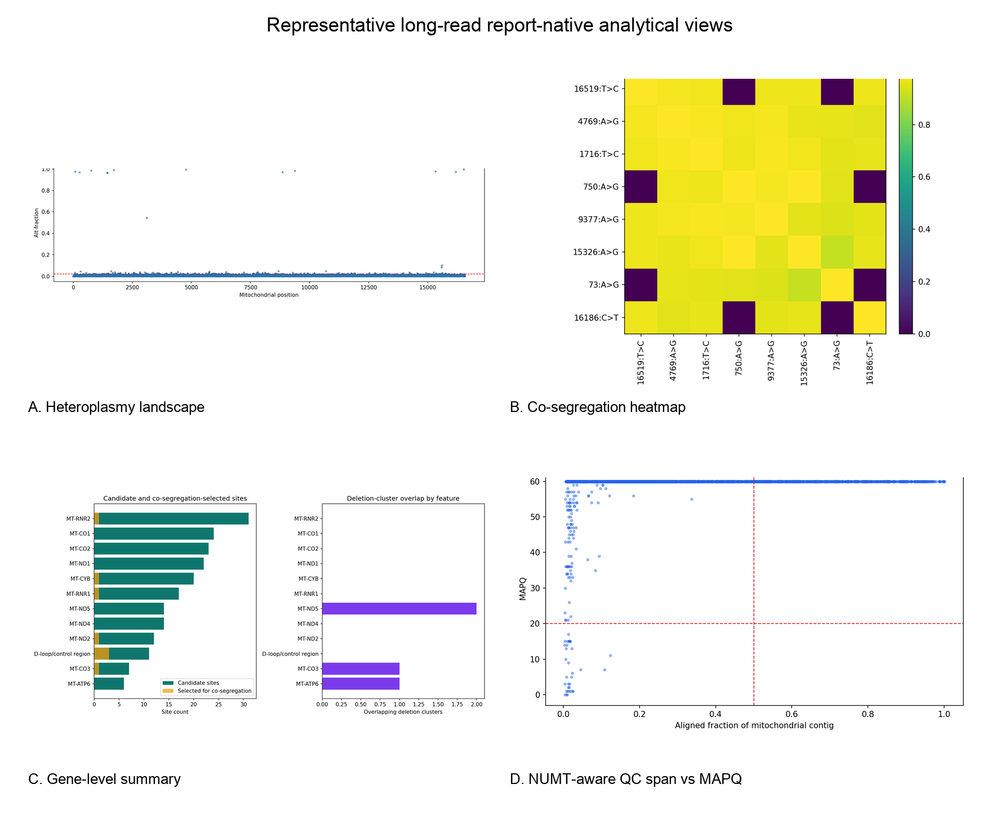

# mito-overview: a modular long-read mitochondrial DNA interpretation and reporting framework

## Running title
`mito-overview` for long-read mtDNA interpretation

## Author
Elisson Lopes

## Affiliation
Affiliation to be finalized before submission

## Correspondence
Correspondence details to be finalized before submission

## Software version
This draft describes `mito-overview` version `0.2.0` at [elissonnog/mito-overview](https://github.com/elissonnog/mito-overview).

## Abstract
Mitochondrial DNA analysis from Oxford Nanopore Technologies (ONT) data often remains fragmented across single-purpose callers, external annotation resources, and custom review steps. This fragmentation is especially limiting for long-read mitochondrial workflows because interpretation may depend not only on variant presence, but also on deletion structure, mtDNA burden proxies, read-level co-segregation, circular-genome edge effects, and quality signals relevant to nuclear mitochondrial DNA segments (NUMTs). We developed `mito-overview`, a modular mtDNA interpretation and reporting framework that converts aligned ONT mitochondrial inputs into layered tabular summaries, figures, and self-contained HTML reports. The current core implementation includes mitochondrial extraction, QC, heteroplasmy summarization, deletion screening, mt:nuclear depth proxy estimation, feature annotation, co-segregation, gene-level aggregation, NUMT-aware QC, identity QC, variant consequence summaries, circularity-aware QC, and an exploratory methylation layer. Two additional human-only enrichment layers are implemented for haplogroup classification and external mtDNA annotation through optional Phy-Mer-compatible and mvTool-style interfaces exercised in the repository with local fixtures. The repository provides a command-line entry point, environment specification, synthetic workflow-validation inputs, tracked example output bundles, and reproducible regeneration of report pages `01` through `14`; these assets support workflow execution and output reproducibility rather than analytical or clinical performance claims. `mito-overview` is intended as a disease-agnostic research framework for ONT mtDNA evidence synthesis and report generation rather than as a clinical diagnostic test.

## Keywords
mitochondrial DNA; Oxford Nanopore; heteroplasmy; deletions; NUMT; haplogroup; reporting workflow; bioinformatics software

## Introduction
Human mitochondrial DNA (mtDNA) is a small circular genome whose interpretation is biologically and technically distinct from standard linear nuclear analysis. Disease-relevant signal can arise through heteroplasmic single-nucleotide variants, large deletions or rearrangements, mtDNA burden differences, and molecule-level structure. At the same time, interpretation can be distorted by extreme depth, circular-reference edge effects, and nuclear mitochondrial DNA segments (NUMTs), the latter of which can generate pseudo-heteroplasmy if they are not handled carefully [1,2]. Oxford Nanopore Technologies (ONT) long reads are well suited to this context because they preserve molecule-scale information and can improve structural interpretation, but they also increase the number of analytical layers that need to be reviewed coherently [3-6].

The current mtDNA software ecosystem includes specialized resources for haplogroup classification, variant interpretation, and annotated mtDNA reporting. Examples include Phy-Mer for alignment-free haplogroup classification [7], HaploGrep 3 for phylogenetic classification and QC [8], mvTool within MSeqDR for mtDNA annotation and nomenclature handling [9], MitoVisualize for structure-aware mtDNA interpretation [10], MToolBox for automated mtDNA reconstruction and prioritization [11], and mtDNA-Server 2 for human mtDNA variant analysis and interactive reporting [12]. ONT-focused analysis tools are also emerging for long-read heteroplasmy analysis and NUMT-aware read discrimination [6,13]. However, there remains a need for a compact sample-level workflow that integrates multiple ONT-relevant layers into one report bundle while remaining reproducible, inspectable, and portable.

`mito-overview` was developed to address that need. It is not intended to replace specialized mtDNA tools or to serve as a best-in-class caller for each event type. Instead, it provides a modular long-read mtDNA evidence-synthesis and reporting framework that organizes long-read-aware analytical layers into one machine-readable and human-readable sample bundle.

## Software scope and design principles
`mito-overview` was designed around five principles.

First, each analytical question is implemented as an independent step that writes its own summaries, figures, and report page. Second, report generation is paired with TSV outputs so that visual review does not come at the expense of downstream reuse. Third, provenance is carried explicitly, including the reference build, mitochondrial contig name, threshold settings, and input-source tracing. Fourth, the reproducible public core is kept separate from optional human-specific enrichments that depend on external tools or services. Fifth, the methylation layer is retained as exploratory context rather than elevated to a primary biological or diagnostic claim, consistent with recent studies reporting no evidence for CpG methylation above modeled background in human mtDNA and no evidence for extensive non-CpG methylation in reanalysis studies [14,15].

## Implementation and workflow
The workflow is driven by an environment-style configuration and accepts aligned BAM or CRAM inputs from which mitochondrial reads can be extracted. Configuration records the sample identifier, reference build, mitochondrial contig, thresholds, output paths, and optional integration settings. The public repository packages the workflow as a Python-based framework with a shell runner, CLI entry point, example configuration, smoke tests, and reproducible example-bundle builders.

The current implemented workflow consists of 18 steps: `validate`, `stage`, `extract`, 14 analytical/reporting steps, and `sync_bioinfo`. Of the 14 report-generating analytical steps, 12 comprise the general public-core analysis and 2 are optional human-only enrichment layers. In the long-read default profile, the 12 public-core analytical pages are:

1. mitochondrial QC
2. heteroplasmy
3. deletion screening
4. mt:nuclear depth proxy
5. mitochondrial feature annotation
6. co-segregation
7. gene summary
8. NUMT-aware QC
9. identity QC
10. variant consequence summary
11. circularity-aware QC
12. exploratory methylation

Two optional human-only enrichment pages are also implemented and, in the public repository, are exercised with local fixtures to verify interface wiring and report generation rather than benchmarked against live external resources:

13. Phy-Mer haplogroup classification
14. mvTool-style external mtDNA annotation

The core pages are intended to run without external network services. For real-world use, the optional pages depend on the underlying external resources and their terms or availability.

The public repository also includes a reduced short-read compatibility profile that is gated by `READ_MODE=short` together with assay-aware settings such as `ASSAY_TYPE=targeted_mt|wgs`. This auxiliary profile was added without changing the long-read default behavior. In the current targeted-mt public example, the active short-read-compatible layers are mitochondrial QC, heteroplasmy, feature annotation, gene summary, variant consequence summary, and optional mvTool-style annotation. Long-read-specific layers that are not supported in this short-read configuration are emitted as explicit `not_applicable` pages rather than being silently interpreted.

## Public workflow and reproducibility assets
The public evidence set was designed as an ordered workflow and reproducibility ladder rather than a single test. The sequence was: package and runtime integrity, long-read workflow regression stability, rebuild reproducibility from tracked public assets, reduced short-read behavior under explicit gating, real-data short-read proof-of-principle, and fresh-clone reproducibility after publication. This ordering was used so that later biological interpretation would only be considered after earlier structural and reproducibility checks had passed.

Tracked public assets include synthetic validation inputs (`TOY-001`), tracked expected example bundles, local fixtures for the optional human-only enrichment layers, and an auxiliary real-data short-read asset pack based on pooled GM11906 public runs. The public validation path includes:

- `python -m mito_overview.cli --list-steps`
- `./tests/smoke_public_pipeline.sh`
- `./scripts/build_public_example_bundle.sh`
- `./tests/smoke_public_pipeline_shortread.sh`
- `./scripts/build_public_shortread_example_bundle.sh`
- `./scripts/run_public_shortread_validation_gm11906.sh`

These validations were run successfully from the local source tree. The package and the reduced short-read profile were also exercised successfully from a fresh GitHub clone using the packaged environment on the validated local Mac setup. The tracked long-read and short-read example bundles contain report pages `01` through `14`, figures, TSV outputs, and helper assets appropriate to their respective profiles. Analytical TSV, HTML, and figure outputs are intended to remain stable across rebuilds. The bundled mitochondrial BAM and BAM index are included for reproducibility and inspection, but byte-level identity is not guaranteed across rebuilds because compression and indexing can vary by environment.

These workflow and reproducibility checks establish installation integrity, step connectivity, profile gating, and output-contract stability. They do not establish analytical accuracy, detection limits, cohort-scale performance, or clinical validity. The synthetic datasets are intentionally minimal and were designed to validate package behavior rather than biological realism.

The repository also includes an auxiliary short-read real-data proof-of-principle example. This example pools three public GM11906 scATAC-seq runs (`SRR10804585`, `SRR10804590`, and `SRR10804657`) associated with the GM11906 single-cell mtDNA/chromatin dataset reported by Lareau and colleagues [16]. Public sample metadata identify GM11906 as a lymphoblastoid cell line carrying `m.8344A>G` [18], and `m.8344A>G` is a pathogenic MERRF-associated `MT-TK` variant [17]. The workflow executes this example in `READ_MODE=short` with `ASSAY_TYPE=targeted_mt`. Under this reduced profile, long-read-specific layers are emitted as explicit `not_applicable` pages while the applicable core layers remain active. In the bundled example output, the workflow reports `m.8344A>G` in the pooled mt-only alignment with depth `1041`, alternate count `754`, estimated heteroplasmy fraction `0.724304`, and `MT-TK` / `tRNA_variant` annotation. This example was included to demonstrate real-data execution under the reduced short-read profile and to show how a previously reported site is represented in the output; it is not presented as a modality-matched benchmark, a calibrated heteroplasmy study, or clinical validation. It also does not establish accurate mt:nuclear copy-number estimation for non-WGS assays or definitive NUMT discrimination from an mt-only alignment strategy.

## Relation to current ONT mtDNA evidence
Published validation evidence currently most clearly supports ONT mtDNA analysis for structural interpretation and moderate-fraction heteroplasmy analysis in validated assay contexts. Long-read sequencing has been shown to improve detection and interpretation of mtDNA deletions and rearrangements, including cases where apparent single-deletion events resolve into more complex structures under long-read inspection [3,4]. A recent ONT heteroplasmy validation study reported strong correlation with expected heteroplasmy above an approximately 12% detection threshold, but high-level variants were underreported and diagnostic use required stringent validation [5].

These publications define the current evidentiary context for interpreting `mito-overview` outputs, but they do not constitute direct performance validation of this workflow. In this manuscript, internal evidence is limited to workflow execution checks, reproducible example regeneration, fixture-based interface testing, and an auxiliary real-data proof-of-principle example. In its current form, the framework is intended to organize long-read-aware QC, heteroplasmy summaries, deletion screening, mtDNA burden context, and report generation. It is not presented here as a validated low-VAF diagnostic caller. Likewise, the methylation page is retained as an exploratory context layer only. This is consistent with studies that found no evidence for CpG methylation above modeled background in human mtDNA by single-molecule ONT analysis and no evidence for extensive non-CpG mtDNA methylation in reanalysis studies [14,15].

NUMT-aware interpretation further emphasizes the need for a dedicated mtDNA workflow rather than simple variant listing. NUMTs are widespread and dynamic in human genomes [1], and published reinterpretations have shown that apparent mtDNA findings can change after better NUMT-aware review [2]. Recent tools such as MitSorter reinforce the value of explicit read-level discrimination strategies in the ONT setting [13]. In `mito-overview`, this motivates dedicated NUMT-aware and circularity-aware QC pages that are reported as separate warning-oriented interpretive layers.

## Results and current release scope
The results reported here are repository-execution and reproducibility results rather than analytical performance results. The current version of `mito-overview` produced a complete public workflow and reproducibility pass across package checks, long-read regression tests, reproducible example-bundle generation, reduced short-read profile checks, a real-data short-read proof-of-principle example, and fresh-clone post-push validation. The public-core workflow produces 12 analytical pages, and the optional enrichment boundary extends that to 14 pages when the human-only Phy-Mer-compatible and mvTool-style layers are exercised.

### Package and workflow integrity
Package and runtime checks passed, indicating that the public installation can expose the expected workflow steps and import the current code without immediate syntax or load-time breakage. This result supports structural usability of the package, but not biological correctness by itself.

The long-read synthetic smoke workflow also passed. In the public synthetic validation path, report pages `01` through `14` were produced successfully, indicating that the long-read public core remains intact and that the optional human-only enrichment layers remain connected in the public codebase. This result supports workflow continuity and regression stability rather than cohort-scale biological benchmarking.

### Reproducible example-bundle generation
Long-read example-bundle regeneration from tracked public assets passed. This result supports the claim that the README and manuscript figures are tied to rebuildable repository outputs rather than one-off local runs. The same logic was confirmed for the reduced short-read bundle: short-read example-bundle regeneration from tracked repository assets also passed, supporting internal consistency of the public short-read documentation path.

### Reduced short-read profile behavior
The short-read synthetic smoke workflow passed under explicit short-read gating. Active short-read-compatible layers executed successfully, while unsupported long-read-specific layers were emitted as explicit `not_applicable` pages. This result supports the claim that the short-read profile behaves honestly as a reduced compatibility path and does not silently reuse long-read-only logic in an unsupported setting.

### Real public short-read proof-of-principle
The pooled GM11906 proof-of-principle example passed on the validated local Mac environment. In this real public dataset, the reduced short-read profile reported `m.8344A>G` with depth `1041`, alternate count `754`, estimated heteroplasmy fraction `0.724304`, `MT-TK` feature context, and `tRNA_variant` consequence annotation. This result supports real-data execution and representation of a previously reported pathogenic mtDNA site under the reduced short-read profile. It does not support a claim of full short-read benchmarking, clinical calibration of heteroplasmy estimates, accurate mt:nuclear copy-number estimation for non-WGS assays, definitive NUMT discrimination from an mt-only alignment strategy, or validation of long-read-only analytical layers in short-read mode.

### Published repository state
Fresh-clone validation after push also passed, indicating that the published GitHub state is usable after cloning into a clean location on the validated Mac environment. This result supports repository reproducibility at the published state rather than portability across every operating system or compute environment.

Taken together, these results support a workflow-level claim: `mito-overview` is a reproducible public long-read mtDNA reporting package, with an auxiliary reduced short-read compatibility path exercised on synthetic inputs and one real public dataset. The strongest support is for workflow reproducibility and package behavior rather than broader performance benchmarking. These results do not support a stronger claim of full modality-matched short-read validation, clinical validation of the package, or replacement of specialized clinical or deletion-specific tools.

## Example figures
### Figure 1. Representative long-read report-native analytical views

This figure is assembled from report-native PNGs produced by a representative long-read example bundle rendered through the standard workflow. The panels show genome-wide heteroplasmy landscape, read-level co-segregation, feature-level burden summary, and the span-versus-MAPQ view used in the NUMT-aware warning layer. Sample-specific title text was removed from the montage, but the rendered analytical views were not otherwise reinterpreted. This figure is intended to show the types of biological views the long-read workflow produces in practice, not to claim pathogenic prioritization, formal NUMT classification, or specialized structural truth beyond the stated warning-oriented and screening roles.

### Figure 2. Auxiliary short-read proof-of-principle compatibility example from pooled public GM11906 scATAC-seq runs

This auxiliary figure summarizes the reduced short-read profile applied to pooled public GM11906 data. The panels show the short-read heteroplasmy landscape together with mitochondrial feature annotation, feature-level gene summary, and variant consequence summary from the public asset pack bundled in the repository. This example is intended to show real-data execution and representation of the previously reported `m.8344A>G` site under the mt-only short-read profile. It is not intended to establish modality-matched or cohort-scale short-read validation, calibrated heteroplasmy benchmarking, non-WGS copy-number estimation, definitive NUMT discrimination, or validation of long-read-only layers.

## Discussion
`mito-overview` is a software/resource contribution for ONT mtDNA evidence synthesis and reporting. Its main contribution lies in modular integration, explicit long-read-aware interpretation layers, and a reproducible public-core implementation. The workflow is therefore complementary to existing mtDNA utilities rather than a replacement for each specialized tool.

## Availability and implementation
Repository:
- [elissonnog/mito-overview](https://github.com/elissonnog/mito-overview)

Implementation assets currently available in the public repository include:
- Python package modules for the workflow and report generation
- shell runner and HPC-oriented wrapper separation
- `environment.yml`
- `pyproject.toml`
- `CITATION.cff`
- tracked synthetic validation inputs
- tracked synthetic example outputs
- smoke-test workflow
- example-bundle regeneration script
- MIT license for the public core repository

Optional external enrichments such as Phy-Mer and mvTool are intentionally kept as optional dependencies rather than bundled redistributable components.

## Limitations and future work
The current release has clear boundaries. Public evidence is limited to synthetic workflow and reproducibility checks, fixture-based testing of optional human-only interfaces, and one auxiliary short-read real-data proof-of-principle example. Copy-number remains a depth proxy rather than an absolute mtDNA copy-number estimate. Deletion output is a structural screen driven by alignment structure rather than a specialized SV caller. NUMT and circularity components are warning-oriented QC layers, not formal classifiers. The most fully exercised public configuration is currently the human mtDNA path, and the optional enrichment modules remain human-only.

The auxiliary short-read example has additional limits. It uses pooled public scATAC-seq runs aligned directly to the mitochondrial reference and therefore supports only a reduced `READ_MODE=short` profile. It should be interpreted as a compatibility example for real-data execution and site recovery, not as a full short-read validation study or a calibrated heteroplasmy benchmark.

Immediate next steps before journal submission include:
- adding cohort-scale quantitative validation tables
- benchmarking selected outputs against specialized external tools where appropriate
- clarifying versioned release metadata and DOI minting
- extending workflow test coverage and real-data evaluation beyond the current human-focused path

A second future direction is downstream classifier work using `mito-overview` outputs as engineered features. That problem is intentionally outside the scope of the current software/resource paper, which is centered on report generation, reproducible workflow structure, and ONT-aware mtDNA interpretation.

## References
1. Wei W, et al. Nuclear-embedded mitochondrial DNA sequences in 66,083 human genomes. *Nature*. 2022. [PubMed](https://pubmed.ncbi.nlm.nih.gov/36198798/)
2. Fleischmann Z, et al. Reanalysis of mtDNA mutations of human primordial germ cells (PGCs) reveals NUMT contamination and suggests that selection in PGCs may be positive. *Mitochondrion*. 2024. [PubMed](https://pubmed.ncbi.nlm.nih.gov/37914096/)
3. Frascarelli C, et al. Nanopore long-read next-generation sequencing for detection of mitochondrial DNA large-scale deletions. *Front Genet*. 2023. [PubMed](https://pubmed.ncbi.nlm.nih.gov/37456669/)
4. Lopriore E, et al. An inherited mtDNA rearrangement, mimicking a single large-scale deletion, associated with MIDD and a primary cardiological phenotype. *Mitochondrion*. 2025. [PubMed](https://pubmed.ncbi.nlm.nih.gov/40164291/)
5. Slapnik B, et al. The quality and detection limits of mitochondrial heteroplasmy by long read nanopore sequencing. *Sci Rep*. 2024. [Nature](https://www.nature.com/articles/s41598-024-78270-0)
6. Jiang L, et al. CmVCall: An automated and adjustable nanopore analysis pipeline for heteroplasmy detection of the control region in human mitochondrial genome. *Forensic Sci Int Genet*. 2023. [PubMed](https://pubmed.ncbi.nlm.nih.gov/37595417/)
7. Navarro-Gomez D, et al. Phy-Mer: a novel alignment-free and reference-independent mitochondrial haplogroup classifier. *Bioinformatics*. 2015. [PubMed](https://pubmed.ncbi.nlm.nih.gov/25505086/)
8. Schönherr S, et al. HaploGrep 3 - an interactive haplogroup classification and analysis platform. *Nucleic Acids Res*. 2023. [PubMed](https://pubmed.ncbi.nlm.nih.gov/37070190/)
9. Shen L, et al. MSeqDR mvTool: a mitochondrial DNA web and API resource for comprehensive variant annotation, universal nomenclature collation, and reference genome conversion. *Hum Mutat*. 2018. [PMC](https://pmc.ncbi.nlm.nih.gov/articles/PMC5992054/)
10. Lake NJ, et al. MitoVisualize: a resource for analysis of variants in human mitochondrial RNAs and DNA. *Bioinformatics*. 2022. [PubMed](https://pubmed.ncbi.nlm.nih.gov/35561159/)
11. Calabrese C, et al. MToolBox: a highly automated pipeline for heteroplasmy annotation and prioritization analysis of human mitochondrial variants in high-throughput sequencing. *Bioinformatics*. 2014. [PubMed](https://pubmed.ncbi.nlm.nih.gov/25028726/)
12. Weissensteiner H, et al. mtDNA-Server 2: advancing mitochondrial DNA analysis through highly parallelized data processing and interactive analytics. *Nucleic Acids Res*. 2024. [PubMed](https://pubmed.ncbi.nlm.nih.gov/38709886/)
13. Cox SN, et al. MitSorter: a standalone tool for accurate discrimination of mtDNA and NuMT ONT reads based on differential methylation. *Bioinformatics Advances*. 2025. [PubMed](https://pubmed.ncbi.nlm.nih.gov/40688360/)
14. Bicci I, et al. Single-molecule mitochondrial DNA sequencing shows no evidence of CpG methylation in human cells and tissues. *Nucleic Acids Res*. 2021. [PubMed](https://pubmed.ncbi.nlm.nih.gov/34850165/)
15. Guitton R, et al. No evidence of extensive non-CpG methylation in mtDNA. *Nucleic Acids Res*. 2022. [PubMed](https://pubmed.ncbi.nlm.nih.gov/35979955/)
16. Lareau CA, Ludwig LS, Muus C, et al. Massively parallel single-cell mitochondrial DNA genotyping and chromatin profiling. *Nat Biotechnol*. 2021. [Nature](https://www.nature.com/articles/s41587-020-0645-6)
17. Shoffner JM, Lott MT, Lezza AMS, et al. Myoclonic epilepsy and ragged-red fiber disease (MERRF) is associated with a mitochondrial DNA tRNA(Lys) mutation. *Cell*. 1990. [PubMed](https://pubmed.ncbi.nlm.nih.gov/2112427/)
18. Coriell Institute for Medical Research. GM11906 sample record. [Coriell](https://www.coriell.org/0/Sections/Search/Sample_Detail.aspx?Ref=GM11906)
